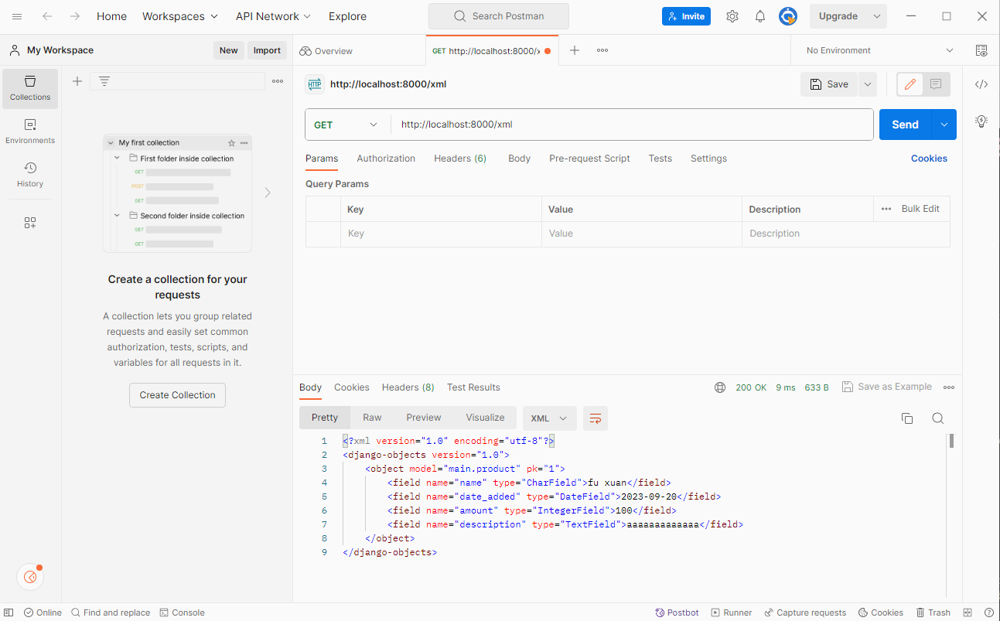
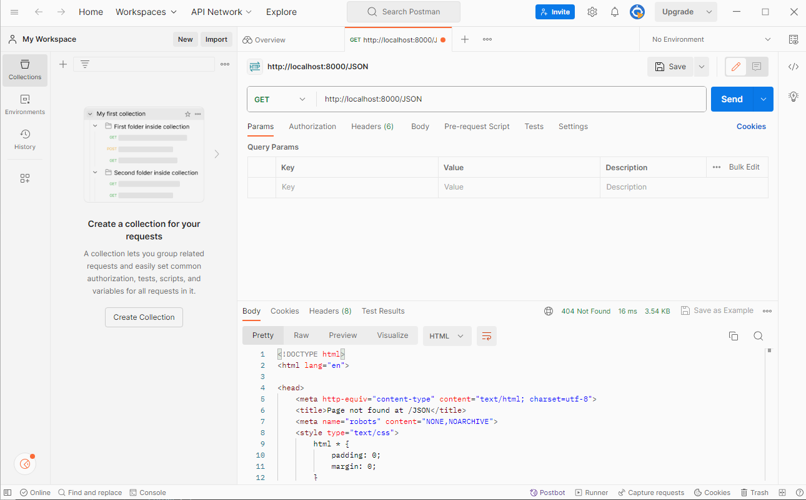
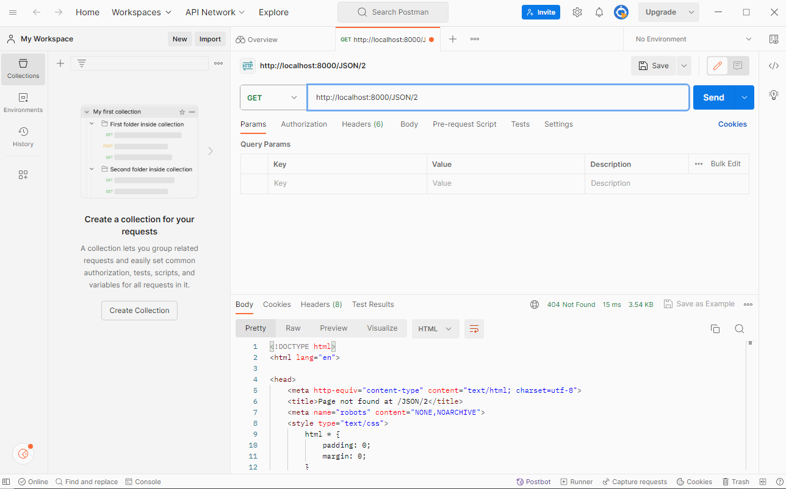
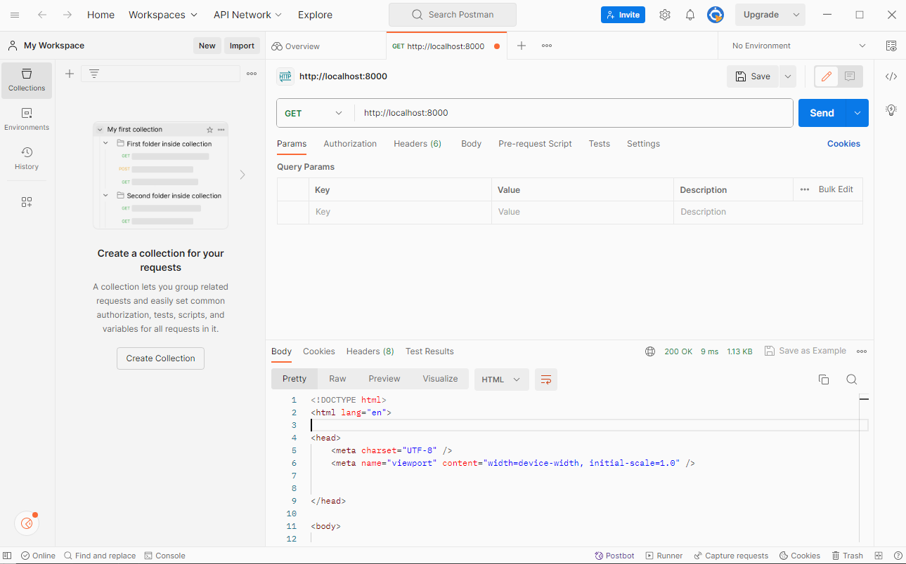
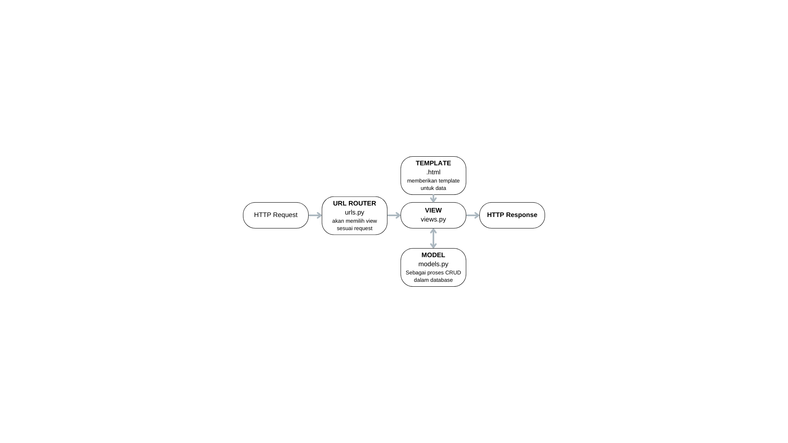

# TUGAS 3

## Perbedaan antara Form POST dan Form GET dalam Django
Form POST dan Form GET merupakan cara untuk mengirim data klien/pengguna ke server pada Django

1. Form POST:
   - Data dikirim dalam tubuh permintaan HTTP.
   - Data yang dihasilkan dari form terkirim sebagai bagian dari body request, bukan  sebagai bagian dari URL.
   - Data tidak terlihat dalam URL, sehingga lebih aman untuk mengirim data sensitif seperti kata sandi.
   - Dapat digunakan untuk mengirim data yang lebih besar daripada Form GET.
   - Biasanya digunakan untuk operasi yang merubah data, seperti menambahkan, mengedit, atau menghapus entitas dalam basis data.
-Pada Django data yang dikirim melalui metode POST biasanya diakses melalui atribut request.POST 
- contoh URL POST :  https://www.contohpost.com/submit

2. Form GET:
   - Data dikirim melalui URL sebagai parameter-query.
   - Data terlihat dalam URL, sehingga kurang aman untuk data sensitif.
   - Biasanya digunakan untuk operasi bacaan, seperti pencarian atau filtrasi data.
   - Dapat dengan mudah dibagikan melalui tautan, karena data ada dalam URL.
   - metode GET sebaiknya tidak digunakan untuk mengirim data sensitif seperti password dan lainnya
   - Metode GET juga tidak cocok untuk mengirim data besar karena keterbatasan panjang URL
- contoh URL GET : https://www.contohsearch.com/search?query=contoh

## Perbedaan Utama antara XML, JSON, dan HTML dalam Konteks Pengiriman Data
XML, JSON, dan HTML merupakan tiga format yang berbeda untuk mengelola dan mengirim informasi dalam pengiriman data. Berikut beberapa perbedaan utama mereka :

1. XML (Extensible Markup Language):
   - Didesain untuk menyimpan dan mengirim data terstruktur dan dapat mendefinisikan skema sendiri.
   - Lebih rumit karena memiliki banyak tag dan atribut yang menyertai data.
   - sering digunakan dalam pertukaran data antara aplikasi yang tidak terkait secara langsung 
   - Digunakan dalam banyak aplikasi, terutama dalam pertukaran data antar sistem dan dalam konfigurasi file.
   - Harus diurai (parsed) untuk mengakses data di dalamnya.
   - parsing XML biasanya memerlukan lebih banyak kode karena struktur yang kompleks.
   

2. JSON (JavaScript Object Notation):
   - Didesain dan memiliki representasi data dalam format ringan serta mudah dibaca oleh manusia dan mesin.
- Lebih sederhana dibandingkan XML dengan sintaksis yang lebih ringkas.
- Umumnya digunakan dalam pertukaran data antara aplikasi web modern karena keterbacaan dan keringkasan sintaksisnya.
- Menggunakan format pasangan nama-nilai (key-value) yang sederhana.
- Parsing JSON lebih mudah karena keringanan format dan kemiripan objek dalam bahasa pemrograman

3. HTML (Hypertext Markup Language):
- Didesain untuk membangun struktur halaman web dan tampilan di web browser.
- Digunakan untuk mengatur tampilan dan hierarki elemen di halaman web.
- HTML memiliki syntax  yang terdiri dari atribut,elemen,dan nilai yang mengatur cara elemen konten ditampilkan dalam halaman web
- Tidak cocok untuk pertukaran data mentah antar aplikasi, karena fokusnya adalah pada tampilan dan interaktivitas di web.
- Parsing HTML dilakukan oleh peramban web

## Mengapa JSON Sering Digunakan dalam Pertukaran Data antara Aplikasi Web Modern

JSON sering digunakan dalam pertukaran data antara aplikasi web modern karena beberapa alasan:
- JSON memiliki syntax yang ringkas dan lebih mudah dibaca oleh manusia dibandingkan XML atau yang lainnya, sehingga lebih efisien dan mudah digunakan
- JSON lebih mudah saat melakukan proses debugging
- JSON mendukung struktur data yang kompleks, termasuk objek dan larik bersarang, sehingga cocok untuk mengirim data yang lebih kompleks.
- Parsing lebih muda karena mendukung banyak bahasa pemrograman dan menghasilkan data dalam format JSON, sehingga dapat dengan mudah diintegrasi ke berbagai aplikasi.
- 
Sebagai hasilnya, JSON telah menjadi salah satu format standar untuk pertukaran data antar aplikasi web modern, menggantikan format lain seperti XML dalam banyak kasus.

## Implementasi Checklist Step-by-Step

- Membuat Form POST dan Form GET dalam Django:

Pertama, buat berkas forms.py dalam direktori main dan isinya dengan atribut yang akan diminta untuk Item.

- Implementasi Form POST:

Selanjutnya, impor modul HttpResponseRedirect, ItemForm, dan reverse. Buat fungsi create_item dalam tampilan (view) dengan menggunakan ItemForm untuk menangani pengiriman data melalui metode POST.

- Mengubah Fungsi show_main:

Di dalam fungsi show_main, tambahkan 'items': items pada bagian context agar daftar Item dapat dikirim ke template.

- Routing untuk Form POST:

Impor fungsi create_item pada berkas urls.py di direktori main dan tambahkan path untuk create_item sehingga halaman create_item dapat diakses melalui URL.

- Membuat Template HTML:

Buat berkas create_item.html dalam direktori main/templates dan isi dengan formulir yang akan ditampilkan pada halaman create_item. Pastikan formulir ini terkait dengan ItemForm yang telah didefinisikan.

- Menampilkan Data di main.html:

Edit berkas main.html agar nantinya data dari Item dapat ditampilkan pada halaman main.

- Implementasi Format Data Lainnya:
Melakukan impor HttpResponse dan serializers pada views.py.
Buat fungsi show_xml, show_json, show_xml_by_id, dan show_json_by_id dalam views.py.
Mengisi fungsi show_xml 
Mengisi fungsi show_json 
Mengisi fungsi show_xml_by_id .
Mengisi fungsi show_json_by_id 

- Routing untuk Format Data:

Melakukan impor fungsi show_xml, show_json, show_xml_by_id, dan show_json_by_id pada urls.py di direktori main.
Menambahkan path pada urlpatterns di urls.py.

- Menguji Fungsi-fungsi:
Mencoba kelima fungsi tersebut pada Postman dengan membuat permintaan baru dan memasukkan URL localhost + path fungsi yang ingin diuji.

## Gambar

# Tugas 2 BPB 
link : https://scudinventory.adaptable.app/main/
## Implementasi checklist

## Bagan Serta Keterkaitan antar Berkas

- urls.py berfungsi sebagai pemilih tampilan/view sesuai request user
- models.py berfungsi sebagai penghubung database dan view saat melakukan pengolahan data
- views.py berfungsi sebagai melakukan logika bisnis yang akan dibantu oleh model dan template
- berkas HTML berfungsi untuk menampilkan data-data yang dimiliki

### Membuat direktori dan projek django
Hal pertama yang saya lakukan adalah membuat direktori untuk projek django tersebut. Membuat direktori dilakukan mulai dari inisiasi git, membuat virtual environment,menambah requirements.txt sampai menambahkan depenciesnya. Setelah itu barulah saya membuat proyek django yang saya inginkan. 

### Membuat aplikasi main dan routing
Selanjutnya setelah memastikan virtual environment aktif, saya membuat main dengan perintah python manage.py startapp main yang kemudian membuat direktori templates. Didalam templates tersebut kemudian saya mengedit tampilan web dengan mengandalkan unsur html dan css seperti card dan div, tidak lupa saya juga menggunakan atribut name, amount, dan description di dalamnya. Setelah itu saya memberikan routing dengan cara mengimport beberapa modul dan menambahkan rute untuk aplikasi main yang saya buat. 

## Virtual environment

### Jelaskan mengapa kita menggunakan virtual environment?
Virtual environment digunakan untuk memisahkan dan mengisolasi lingkungan kerja proyek secara terpisah. Ada beberapa alasan mengapa kita menggunakan virtual environmen.Dengan virtual environment, setiap proyek akan memiliki lingkungan kerjanya sendiri yang terisolasi. Hal ini membuat setiap proyek dependensi, yang memungkinkan proyek dapat diinstal secara terpisah tanpa saling mempengaruhi dan menghindari konflik satu sama lain. Virtual environment juga mendukung fleksibilitas versi phyton yang kita gunakan sehingga dapat menyesuaikan dengan kebutuhan proyek kita. 

### Apakah kita tetap dapat membuat aplikasi web berbasis Django tanpa menggunakan virtual environment?
Kita dapat melakukan hal tersebut, namun meskipun memungkinkan untuk membuat aplikasi web berbasis Django tanpa menggunakan virtual environment, saya sangat menyarankan untuk menggunakan virtual environment agar menjaga kerapihan dan keteraturan proyek. Dengan virtual environment kita dapat lebih mudah mengelola banyak proyek tanpa konflik serta memastikan konsistensi dalam pengembangan proyek django yang dikembangkan. 

## MVC, MVT, MVVM dan perbedaannya
### MVT (Model-View-Template)
- Pengguna mengakses satu URL tertentu.
- Django akan mencocokkan URL dengan pola yang sesuai dalam berkas urls.py dan menentukan View yang akan menangani permintaan tersebut.
- View menerima permintaan dan menjalankan logika bisnis yang dibutuhkan oleh aplikasi.
- Jika View memerlukan data dari basis data, View akan berkomunikasi melalui Model sebagai perantara.
- Setelah Model selesai memproses data dalam basis data, View akan menggunakan templat (HTML) untuk merender data tersebut ke dalam tampilan yang diinginkan.
- Setelah templat selesai mengatur tampilan, View akan menghasilkan halaman HTML yang telah dirender bersama dengan respons HTTP yang sesuai.
- Respons HTTP tersebut berisi halaman HTML yang diminta oleh pengguna.
### MVC (Model-View-Controller)
- user berinteraksi dengan view dengan melakukan suatu action.
- action kemudian diteruskan ke Controller, pada Controller action tersebut diproses sesuai kebutuhan aplikasi.
- Controller akan berinteraksi dengan Model untuk mengambil atau mengubah data pada Model.
- Setelah berinteraksi dengan Model, Controller akan  mengupdate data yang akan ditampilkan dan mengirimkan ke View.
- View menerima data dari Controller kemudian mengupdate tampilan interface.
### MVVM (Model-View-ViewModel)
- Pengguna berinteraksi dengan Tampilan melalui tindakan yang dilakukan.
- Tindakan yang diterima oleh Tampilan akan diteruskan ke Model Tampilan (ViewModel).
- ViewModel mengelola logika bisnis aplikasi dan berfungsi sebagai perantara antara Tampilan dan Model.
- Jika diperlukan untuk berinteraksi dengan basis data, Model akan melakukan interaksi tersebut.
- Setelah data dari basis data diperoleh, Model akan meneruskannya ke ViewModel.
- Kemudian, ViewModel akan menjalankan proses yang dibutuhkan oleh aplikasi pada data yang diterima sebelum mengirimkannya kembali ke Tampilan.
- Setelah data yang telah diproses diteruskan ke Tampilan, Tampilan akan melakukan pengaturan tampilan sesuai dengan kebutuhan.
- Setelah itu, pengguna dapat melihat tampilan yang telah diperbarui dan siap untuk melakukan interaksi selanjutnya.

